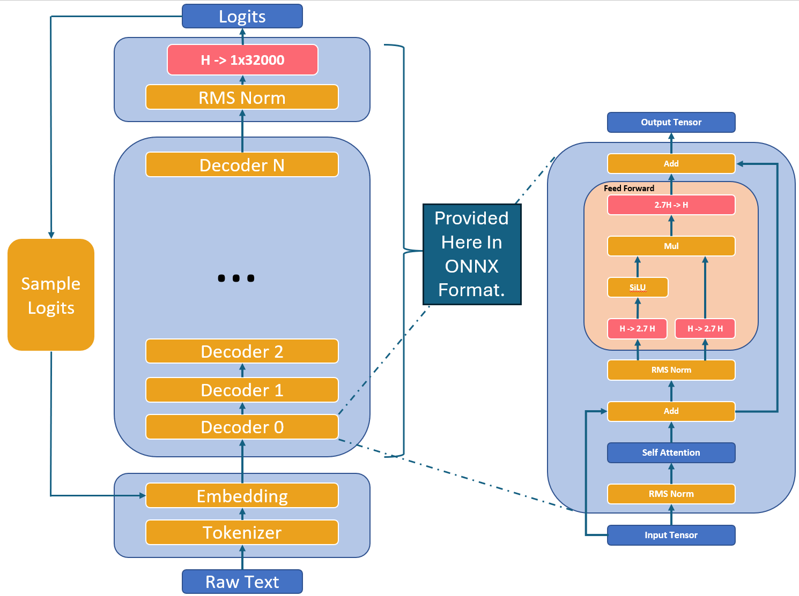
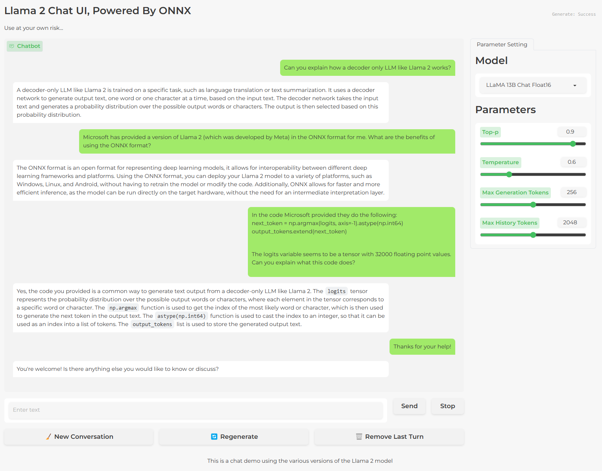

# **Llama 2 Powered By ONNX**

**This is an optimized version of the Llama 2 model, available from Meta under the Llama Community License Agreement found on this repository. Microsoft permits you to use, modify, redistribute and create derivatives of Microsoft's contributions to the optimized version subject to the restrictions and disclaimers of warranty and liability in the Llama Community License agreement.**

# **Before You Start**
The sub-modules that contain the ONNX files in this repository are access controlled.
To get access permissions to the Llama 2 model, please fill out the [Llama 2 access request form](https://forms.microsoft.com/Pages/ResponsePage.aspx?id=v4j5cvGGr0GRqy180BHbR1sq8AbaR35DlqQqW8HAxY1UQlU4UThHTlFWVUUwMzBXV1gxWENRTjRHRi4u). If allowable, you will receive GitHub access in the next 48 hours, but usually much sooner.

## **Cloning This Repository And The Submodules**
Before you begin, ensure you have Git LFS installed. Git LFS (Large File Storage) is used to handle large files efficiently. You can find out how to install Git LFS for your operating system at [https://git-lfs.com/](https://git-lfs.com/). 

Next, you can choose which version of the Llama 2 model you would like to use by selecting the appropriate submodule.

Chose from the following sub-modules:
* 7B_FT_float16
* 7B_FT_float32
* 7B_float16
* 7B_float32
* 13B_FT_float16
* 13B_FT_float32
* 13B_float16
* 13B_float32
``` bash
git clone https://github.com/microsoft/Llama-2-Onnx.git
cd Llama-2-Onnx
git submodule init <chosen_submodule> 
git submodule update
```
You can repeate the init command with a different submodule name to initialize multiple submodules. Be careful, the contained files are very large! (7B Float16 models are about 10GB)

# **What is Llama 2?**
Llama 2 is a collection of pretrained and fine-tuned generative text models. To learn more about Llama 2, review the [Llama 2 model card](https://github.com/microsoft/Llama-2-Onnx/blob/main/MODEL-CARD-META-LLAMA-2.md).

## **What Is The Structure Of Llama 2?**
Llama 2 model consists of a stack of decoder layers. Each decoder layer (or transformer block) is constructed from one self-attention layer and one feed-forward multi-layer perceptron. Llama models use different projection sizes compared with classic transformers in the feed-forward layer, for instance, both Llama 1 and Llama 2 projection use 2.7x hidden size rather than the standard 4x hidden size. A key difference between Llama 1 and Llama 2 is the architectural change of attention layer, in which Llama 2 takes advantage of Grouped Query Attention (GQA) mechanism to improve efficiency.




# **FAQ**
## **Is There A Simple Code Example Running Llama 2 With ONNX?**
There are two examples provided in this repository. There is a minimum working example shown in [Llama-2-Onnx/MinimumExample](https://github.com/microsoft/Llama-2-Onnx/blob/main/MinimumExample/Example.md). This is simply a command line program that will complete some text with the chosen version of Llama 2.

Given the following input:

<!-- Section of bash code -->
```bash
python MinimumExample/Example_ONNX_LlamaV2.py --onnx_file 7B_FT_float16/ONNX/LlamaV2_7B_FT_float16.onnx --embedding_file 7B_FT_float16/embeddings.pth --tokenizer_path tokenizer.model --prompt "What is the lightest element?"
```
Output:
```bash
The lightest element is hydrogen. Hydrogen is the lightest element on the periodic table, with an atomic mass of 1.00794 u (unified atomic mass units).
```

## **Is There A More Complete Code Example Running Llama 2 With ONNX?**
There is a more complete chat bot interface that is available in [Llama-2-Onnx/ChatApp](https://github.com/microsoft/Llama-2-Onnx/blob/main/ChatApp/ChatApp.md). This is a python program based on the popular Gradio web interface. It will allow you to interact with the chosen version of Llama 2 in a chat bot interface. 

An example interaction can be seen here:



## **How Do I Use The Fine-tuned Models?**
The fine-tuned models were trained for dialogue applications.

To get the expected features and performance for them, a specific formatting needs to be followed, including the `INST` tag, `BOS` and `EOS` tokens, and the whitespaces and breaklines in between (we recommend calling `strip()` on inputs to avoid double-spaces).

This enables models in chat mode as well as additional safeguards  to reduce potentially undesirable output.
 

## **Why Is The First Inference Session Slow?** 
ONNX runtime execution provider might need to generate JIT binaries for the underlying hardware, typically the binary is cache and will be loaded directly in the subsequent runs to reduce the overhead. 

 

## **Why Is FP16 ONNX Slower Than ONNX FP32 On My Device?** 
It is possible that your device does not support native FP16 math, therefore weights will be cast to FP32 at runtime. Using the FP32 version of the model will avoid the cast overhead.

 

## **How Do I Get Better Inference Speed?** 
It is recommended that inputs/outputs are put on target device to avoid expensive data copies, please refer to the following document for details.  

[I/O Binding | onnxruntime](https://onnxruntime.ai/docs/performance/tune-performance/iobinding.html) 


## **What Parameters Should I Test With?** 
Users can perform temperature and top-p sampling using the model’s output logits. Please refer to Meta’s guidance for the best parameters combination; an example is located [here.](https://github.com/facebookresearch/llama/)


## **How Can I Develop With Llama 2 Responsibly?**
In order to help developers innovate responsibly, Meta encourages you to review the [Responsible Use Guide](https://ai.meta.com/llama/responsible-use-guide/) for the Llama 2 models.

Microsoft encourages you to learn more about its [Responsible AI approach](https://aka.ms/rai), including many publicly available resources and tools for developers.
